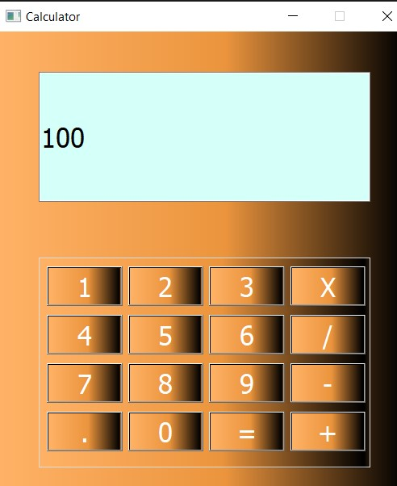

# Calculator

- This project is a Desktop calculator that performs the arithmetic operations of addition, subtraction, multiplication and division.

*  to  apply addition we can see the following screan 
        

        
* the final value 

        

