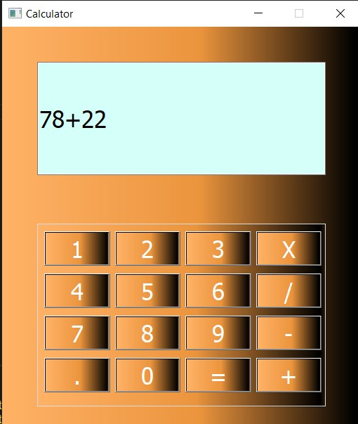

# Calculator

- This project is a Desktop calculator that performs the arithmetic operations of addition, subtraction, multiplication and division.

* ### to  apply addition we can see the following screan 

   

 

